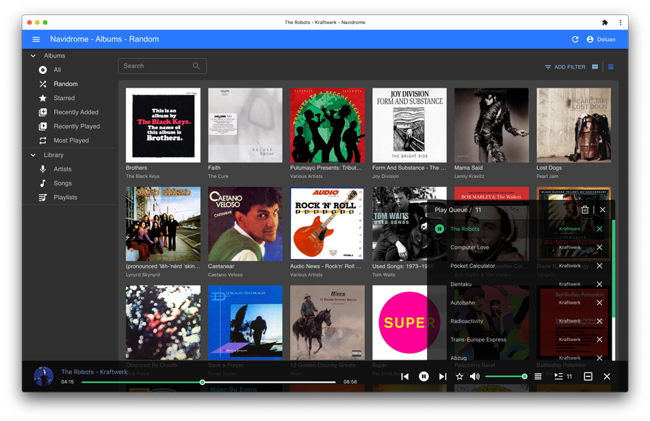

<!--
N.B.: README ini dibuat secara otomatis oleh <https://github.com/YunoHost/apps/tree/master/tools/readme_generator>
Ini TIDAK boleh diedit dengan tangan.
-->

# Navidrome untuk YunoHost

[](https://ci-apps.yunohost.org/ci/apps/navidrome/)


[](https://install-app.yunohost.org/?app=navidrome)

*[Baca README ini dengan bahasa yang lain.](./ALL_README.md)*

> *Paket ini memperbolehkan Anda untuk memasang Navidrome secara cepat dan mudah pada server YunoHost.*  
> *Bila Anda tidak mempunyai YunoHost, silakan berkonsultasi dengan [panduan](https://yunohost.org/install) untuk mempelajari bagaimana untuk memasangnya.*

## Ringkasan

Navidrome a software that allows you to listen to your own digital music in the same way you would with services like Spotify, Apple Music and others. It also allows you to easily share your music and playlists with your friends and family.s
Navidrome indexes all digital music stored in your hard drive and makes it available through a nice web player and also by using any Subsonic-API compatible mobile client. Your music becomes searchable and you can create playlists, rate and “favourite” your loved tracks, albums and artists

### Features

- Handles very large music collections
- Streams virtually any audio format available
- Reads and uses all your beautifully curated metadata
- Great support for compilations (Various Artists albums) and box sets (multi-disc albums)
- Multi-user, each user has their own play counts, playlists, favourites, etc...
- Very low resource usage
- Automatically monitors your library for changes, importing new files and reloading new metadata
- Compatible with all Subsonic/Madsonic/Airsonic clients
- Transcoding on the fly. Can be set per user/player. Opus encoding is supported


**Versi terkirim:** 0.55.1~ynh1

**Demo:** <https://demo.navidrome.org/app/#/login>

## Tangkapan Layar



## Dokumentasi dan sumber daya

- Website aplikasi resmi: <https://www.navidrome.org>
- Dokumentasi admin resmi: <https://www.navidrome.org/docs>
- Depot kode aplikasi hulu: <https://github.com/navidrome/navidrome>
- Gudang YunoHost: <https://apps.yunohost.org/app/navidrome>
- Laporkan bug: <https://github.com/YunoHost-Apps/navidrome_ynh/issues>

## Info developer

Silakan kirim pull request ke [`testing` branch](https://github.com/YunoHost-Apps/navidrome_ynh/tree/testing).

Untuk mencoba branch `testing`, silakan dilanjutkan seperti:

```bash
sudo yunohost app install https://github.com/YunoHost-Apps/navidrome_ynh/tree/testing --debug
atau
sudo yunohost app upgrade navidrome -u https://github.com/YunoHost-Apps/navidrome_ynh/tree/testing --debug
```

**Info lebih lanjut mengenai pemaketan aplikasi:** <https://yunohost.org/packaging_apps>
