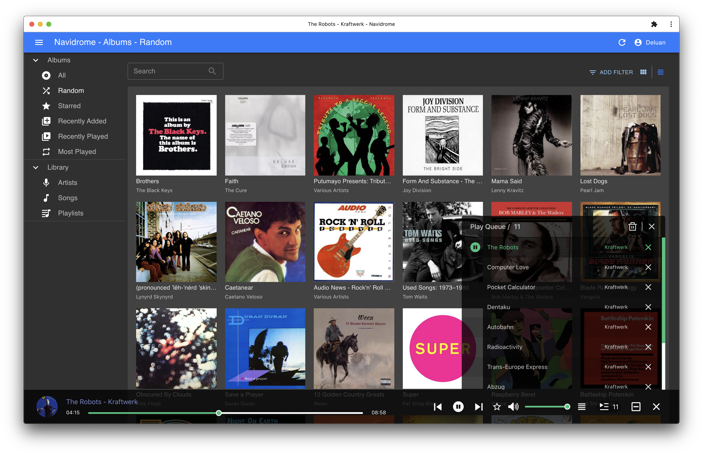

<!--
注意：此 README 由 <https://github.com/YunoHost/apps/tree/master/tools/readme_generator> 自动生成
请勿手动编辑。
-->

# YunoHost 上的 Navidrome

[](https://ci-apps.yunohost.org/ci/apps/navidrome/)  

[](https://install-app.yunohost.org/?app=navidrome)

*[阅读此 README 的其它语言版本。](./ALL_README.md)*

> *通过此软件包，您可以在 YunoHost 服务器上快速、简单地安装 Navidrome。*  
> *如果您还没有 YunoHost，请参阅[指南](https://yunohost.org/install)了解如何安装它。*

## 概况

Navidrome a software that allows you to listen to your own digital music in the same way you would with services like Spotify, Apple Music and others. It also allows you to easily share your music and playlists with your friends and family.s
Navidrome indexes all digital music stored in your hard drive and makes it available through a nice web player and also by using any Subsonic-API compatible mobile client. Your music becomes searchable and you can create playlists, rate and “favourite” your loved tracks, albums and artists

### Features

- Handles very large music collections
- Streams virtually any audio format available
- Reads and uses all your beautifully curated metadata
- Great support for compilations (Various Artists albums) and box sets (multi-disc albums)
- Multi-user, each user has their own play counts, playlists, favourites, etc...
- Very low resource usage
- Automatically monitors your library for changes, importing new files and reloading new metadata
- Compatible with all Subsonic/Madsonic/Airsonic clients
- Transcoding on the fly. Can be set per user/player. Opus encoding is supported


**分发版本：** 0.53.0~ynh1

**演示：** <https://demo.navidrome.org/app/#/login>

## 截图



## 文档与资源

- 官方应用网站： <https://www.navidrome.org>
- 官方管理文档： <https://www.navidrome.org/docs>
- 上游应用代码库： <https://github.com/deluan/navidrome>
- YunoHost 商店： <https://apps.yunohost.org/app/navidrome>
- 报告 bug： <https://github.com/YunoHost-Apps/navidrome_ynh/issues>

## 开发者信息

请向 [`testing` 分支](https://github.com/YunoHost-Apps/navidrome_ynh/tree/testing) 发送拉取请求。

如要尝试 `testing` 分支，请这样操作：

```bash
sudo yunohost app install https://github.com/YunoHost-Apps/navidrome_ynh/tree/testing --debug
或
sudo yunohost app upgrade navidrome -u https://github.com/YunoHost-Apps/navidrome_ynh/tree/testing --debug
```

**有关应用打包的更多信息：** <https://yunohost.org/packaging_apps>
